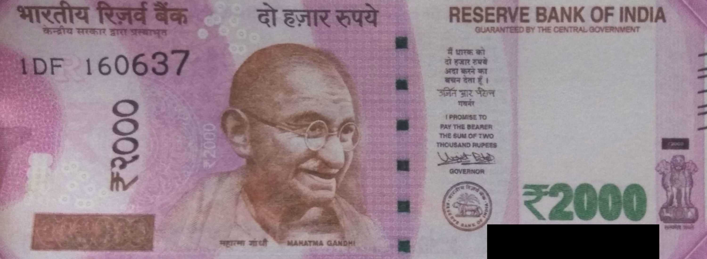

# 🧾 Fake Currency Detection using Image Processing

This project uses image processing techniques in Python to detect the authenticity of ₹2000 Indian currency notes based on key visual features such as the transparent Gandhi watermark and the green security strip.

## 📂 Project Files

* `Untitled.ipynb`: Main Jupyter notebook implementing the detection logic.
* `real note.png`, `Real.jpg`: Images of genuine ₹2000 currency notes.
* `fake.jpg`: Image of a suspected fake ₹2000 note.

## 🔍 Features Checked

1. **Transparent Gandhi Watermark**:

   * Uses correlation between image regions to detect the presence of the watermark.

2. **Green Security Strip**:

   * Checks for the alignment and color patterns of the green strip.

3. **Similarity Metrics**:

   * Employs pixel correlation to compare real and test currency images.

## 🧪 Output Logic

The program prints:

* Whether the correlation of the transparent Gandhi image is ≥ 0.5.
* If both watermark and security strip are valid, the currency is marked **legitimate**.
* Otherwise, it's flagged as **fake**.

## ▶️ How to Run

1. Clone the repository:

   ```bash
   git clone https://github.com/your-username/fake-currency-detection.git
   cd fake-currency-detection
   ```

2. Install required packages:

   ```bash
   pip install numpy matplotlib opencv-python
   ```

3. Launch the Jupyter Notebook:

   ```bash
   jupyter notebook Untitled.ipynb
   ```

4. Follow the cells and run them in sequence.

## 📷 Sample Images




## 📌 Notes

* This is a basic implementation for educational/demo purposes.
* Real-world applications would require more robust machine learning models and dataset variety.


